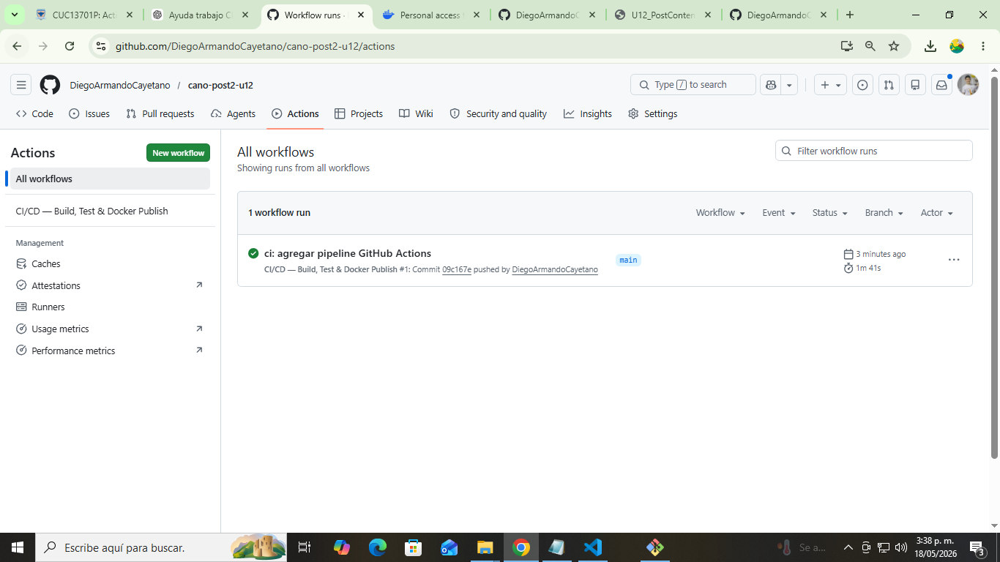
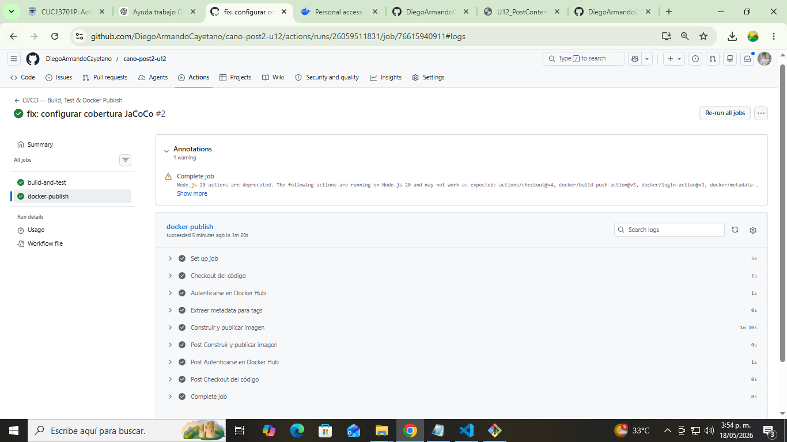
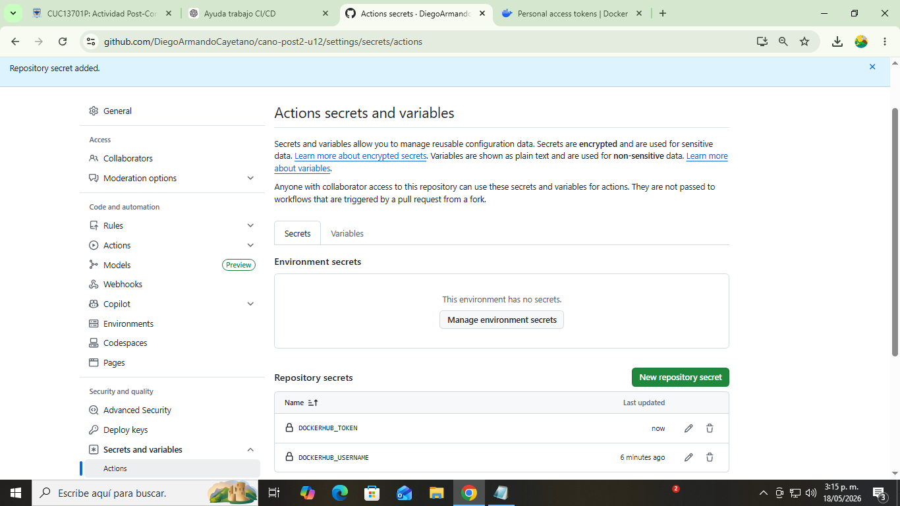
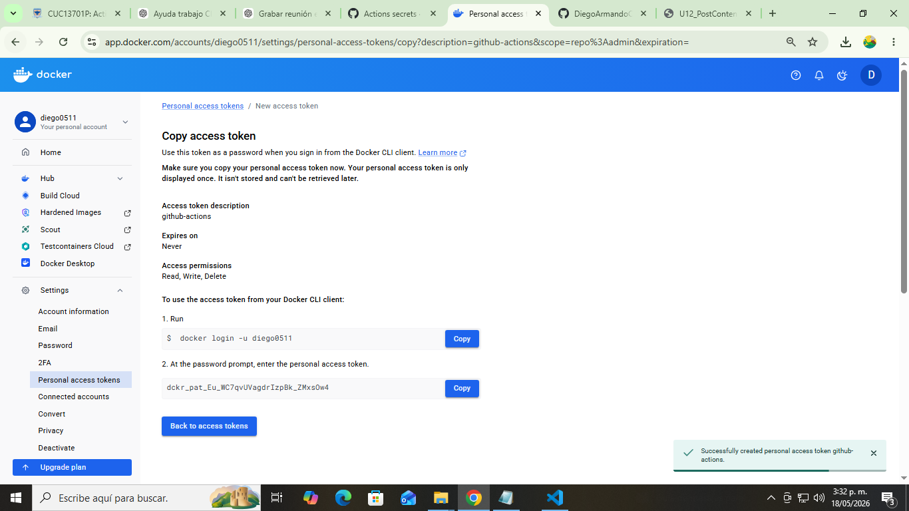
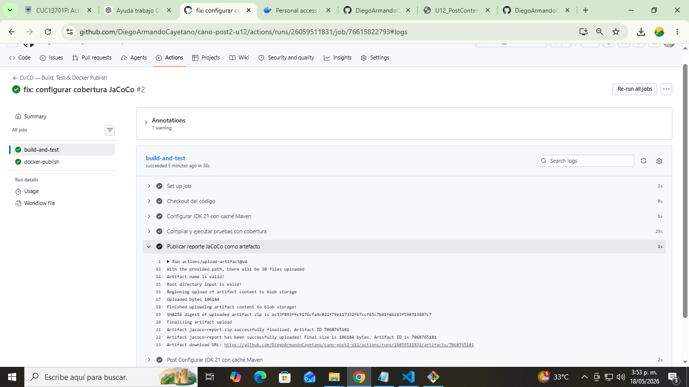
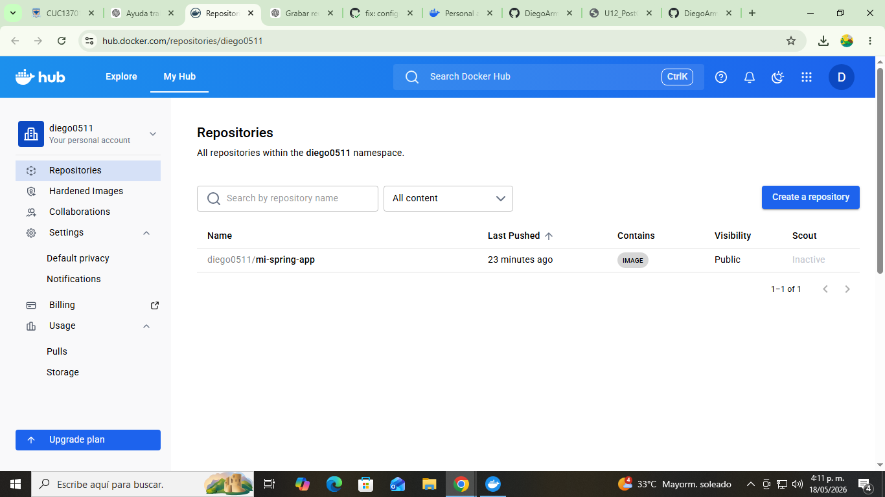

# Mi Spring App


## Descripción

Proyecto desarrollado en Spring Boot para implementar un pipeline completo de CI/CD utilizando GitHub Actions y Docker Hub.

Este proyecto automatiza:

- Compilación con Maven
- Ejecución de pruebas automáticas
- Generación del reporte de cobertura JaCoCo
- Construcción de imagen Docker con multi-stage build
- Publicación automática en Docker Hub

---

## Tecnologías Utilizadas

- Java 21
- Spring Boot
- Maven
- Docker
- GitHub Actions
- JaCoCo
- Docker Hub

---

## Pipeline CI/CD

El workflow se ejecuta automáticamente en cada `push` a la rama `main`.

### Job 1 — build-and-test

Este job realiza:

- Checkout del código
- Configuración de Java 21
- Caché Maven
- Compilación del proyecto
- Ejecución de pruebas
- Generación de cobertura JaCoCo
- Publicación del reporte como artifact

### Job 2 — docker-publish

Este job depende de `build-and-test` y realiza:

- Login en Docker Hub mediante GitHub Secrets
- Construcción automática de la imagen Docker
- Publicación automática en Docker Hub
- Generación de tags:

```text
latest
sha-<commit>
```

---

## GitHub Secrets Requeridos

Los Secrets configurados en GitHub fueron:

```text
DOCKERHUB_USERNAME
DOCKERHUB_TOKEN
```

Estos Secrets permiten autenticar GitHub Actions con Docker Hub de forma segura sin exponer credenciales en el workflow YAML.

---

## Imagen Docker

### Descargar imagen

```bash
docker pull TUUSUARIO/mi-spring-app:latest
```

### Ejecutar contenedor

```bash
docker run -p 8080:8080 TUUSUARIO/mi-spring-app:latest
```

---

# Evidencias del Proyecto

## Pipeline GitHub Actions Exitoso

Se evidencia la ejecución completa del workflow con ambos jobs en estado exitoso.



---

## Publicación Docker Publish

Se evidencia la construcción y publicación automática de la imagen.



---

## GitHub Secrets Configurados

Se muestran los Secrets requeridos para autenticación con Docker Hub.



---

## Docker Hub Access Token

Token generado para integración segura con GitHub Actions.



---

## Artifact JaCoCo

Reporte JaCoCo generado y publicado correctamente como artifact descargable.



---

## Docker Hub Tags

Imagen publicada correctamente con los tags `latest` y `sha`.



---

## Estructura del Proyecto

```text
cano-post2-u12/
│
├── .github/
│   └── workflows/
│       └── ci.yml
│
├── docs/
│   ├── actions_pipeline_success.PNG
│   ├── docker-publish.PNG
│   ├── dockerhub_tags.PNG
│   ├── dockerhub_token.PNG
│   ├── github_secrets.PNG
│   └── jacoco_artifact.PNG
│
├── src/
├── Dockerfile
├── pom.xml
└── README.md
```

---

## Commits Realizados

```text
ci: agregar pipeline GitHub Actions
fix: configurar cobertura JaCoCo
docs: agregar badge y documentacion CI/CD
```

---

## Autor

**Diego Armando Cayetano**  
Ingeniería de Sistemas — Programación Web  
2026
